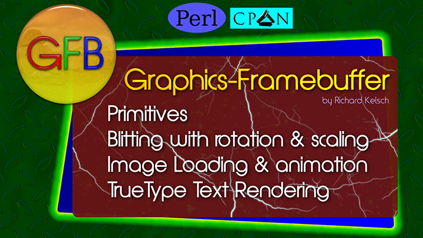
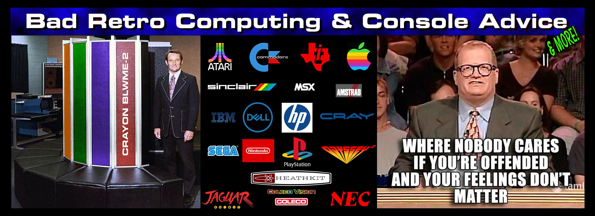

# Richard Kelsch's Music

This repository contains the music I have been writing.  There are lyrics and music.  All Music is in FLAC format.

## Songs

|  | Song Name | Lyrics | License |
| :--- | :--- | :--- | :--- |
|  | [Katelynn's Cheer](https://github.com/richcsst/My-Music/blob/main/FLAC/Matt's%20Off-Road%20Recovery/Matt's%20Off-Road%20Recovery%20-%20Katelynn's%20Cheer.flac) | [Katelynn's Cheer Lyrics](https://github.com/richcsst/My-Music/blob/main/Lyrics/Matt's%20Off-Road%20Recovery/Matt's%20Off-Road%20Recovery%20-%20Katelynn's%20Cheer.txt) | Licensed to **Matt's Off-Road Recovery** to broadcast and use in events with attribution |
|  | [Theme Country Rock Version](https://github.com/richcsst/My-Music/blob/main/FLAC/Matt's%20Off-Road%20Recovery/Matt's%20Off-Road%20Recovery%20-%20Country%20Rock.flac) | [MORR Theme Lyrics](https://github.com/richcsst/My-Music/blob/main/Lyrics/Matt's%20Off-Road%20Recovery/Matt's%20Off-Road%20Recovery%20-%20Theme.txt) | Licensed to **Matt's Off-Road Recovery** to broadcast and use in events with attribution |
|  | [Theme Country Rock Slow Tempo](https://github.com/richcsst/My-Music/blob/main/FLAC/Matt's%20Off-Road%20Recovery/Matt's%20Off-Road%20Recovery%20-%20Country%20Rock%20Slow%20Tempo.flac) | [MORR Theme Lyrics](https://github.com/richcsst/My-Music/blob/main/Lyrics/Matt's%20Off-Road%20Recovery/Matt's%20Off-Road%20Recovery%20-%20Theme.txt) | Licensed to **Matt's Off-Road Recovery** to broadcast and use in events with attribution |
|  | [Theme Acoustic Country Version](https://github.com/richcsst/My-Music/blob/main/FLAC/Matt's%20Off-Road%20Recovery/Matt's%20Off-Road%20Recovery%20-%20Acoustic%20Country.flac) | [MORR Theme Lyrics](https://github.com/richcsst/My-Music/blob/main/Lyrics/Matt's%20Off-Road%20Recovery/Matt's%20Off-Road%20Recovery%20-%20Theme.txt) | Licensed to **Matt's Off-Road Recovery** to broadcast and use in events with attribution |
|  | [Theme Country Version](https://github.com/richcsst/My-Music/blob/main/FLAC/Matt's%20Off-Road%20Recovery/Matt's%20Off-Road%20Recovery%20-%20Country.flac) | [MORR Theme Lyrics](https://github.com/richcsst/My-Music/blob/main/Lyrics/Matt's%20Off-Road%20Recovery/Matt's%20Off-Road%20Recovery%20-%20Theme.txt) | Licensed to **Matt's Off-Road Recovery** to broadcast and use in events with attribution |
|  | [Perl CPAN Module - Term-ANSIEncode Jingle](https://github.com/richcsst/My-Music/blob/main/FLAC/Programming/ANSI-Encode.flac) | [Perl CPAN Module - Term-ANSIEncode Jingle Lyrics](https://github.com/richcsst/My-Music/blob/main/Lyrics/Programming/ANSI-Encode.txt) | Fair Use Only |
|  | [Perl CPAN Module - Debug-Easy Jingle](https://github.com/richcsst/My-Music/blob/main/FLAC/Programming/Debug-Easy.flac) | [Perl CPAN Module - Debug-Easy Jingle Lyrics](https://github.com/richcsst/My-Music/blob/main/Lyrics/Programming/Debug-Easy.txt) | Fair Use Only |
|  | [Perl CPAN Module - Graphics-Framebuffer](https://github.com/richcsst/My-Music/blob/main/FLAC/Programming/GFB%20Framebuffer.flac) | [Perl CPAN Module - Graphics-Framebuffer Lyrics](https://github.com/richcsst/My-Music/blob/main/Lyrics/Programming/GFB%20Framebuffer.txt) | Fair Use Only |
|  | [Bad Retro Computing & Console Advice](https://github.com/richcsst/My-Music/blob/main/FLAC/Facebook%20Group/Bad%20Retro%20Computing%20and%20Console%20Advice.flac) | [Bad Retro Computing & Console Advice Lyrics](https://github.com/richcsst/My-Music/blob/main/FLAC/Facebook%20Group/Bad%20Retro%20Computing%20and%20Console%20Advice.txt) | Fair Use Only |
| | [Jer-Bear On The Highway](https://github.com/richcsst/My-Music/blob/main/FLAC/Family/Jer-Bear%20On%20The%20Highway.flac) | [Jer-Bear On The Highway Lyrics](https://github.com/richcsst/My-Music/blob/main/Lyrics/Family/Jer-Bear%20On%20The%20Highway.txt) | Kelsch Family Use Only |
| | [Karen In Arizona](https://github.com/richcsst/My-Music/blob/main/FLAC/Family/Karen%20In%20Arizona.flac) | [Karen In Arizona Lyrics](https://github.com/richcsst/My-Music/blob/main/Lyrics/Family/Karen%20In%20Arizona.txt) | Kelsch Family Use Only |
| | [Weenie In Kingman](https://github.com/richcsst/My-Music/blob/main/FLAC/Family/Weenie%20In%20Kingman.flac) | [Weenie In Kingman Lyrics](https://github.com/richcsst/My-Music/blob/main/Lyrics/Family/Weenie%20In%20Kingman.txt) | Kelsch Family Use Only |
| | [Weenie On The Lake](https://github.com/richcsst/My-Music/blob/main/FLAC/Family/Weenie%20On%20The%20Lake.flac) | [Weenie On The Lake Lyrics](https://github.com/richcsst/My-Music/blob/main/Lyrics/Family/Weenie%20On%20The%20Lake.txt) | Kelsch Family Use Only |
| | [Desert Marathon Hearts](https://github.com/richcsst/My-Music/blob/main/FLAC/Friends/Desert%20Marathon%20Hearts.flac) | [Desert Marathon Hearts Lyrics](https://github.com/richcsst/My-Music/blob/main/Lyrics/Friends/Desert%20Marathon%20Hearts.txt) | Family and Friends Only |
| | [Run, Rhonda, Run](https://github.com/richcsst/My-Music/blob/main/FLAC/Friends/Run,%20Rhonda,%20Run.flac) | [Run, Rhonda, Run Lyrics](https://github.com/richcsst/My-Music/blob/main/Lyrics/Friends/Run,%20Rhonda,%20Run.txt) | Family and Friends Only |
| | [Black Camaro, Desert Mile](https://github.com/richcsst/My-Music/blob/main/FLAC/Friends/Black%20Camaro,%20Desert%20Mile.flac) | [Black Camaro, Desert Mile Lyrics](https://github.com/richcsst/My-Music/blob/main/Lyrics/Friends/Black%20Camaro,%20Desert%20Mile.txt) | Family and Friends Only |
| | [Troy](https://github.com/richcsst/My-Music/blob/main/FLAC/Friends/Troy.flac) | [Troy Lyrics](https://github.com/richcsst/My-Music/blob/main/Lyrics/Friends/Troy.txt) | Family and Friends Only |

## COPYRIGHT

Copyright © 2026 Richard Kelsch
All Rights Are Reserved

## LICENSE

All music rights for broadcast and performance are reserved, except where indicated.
